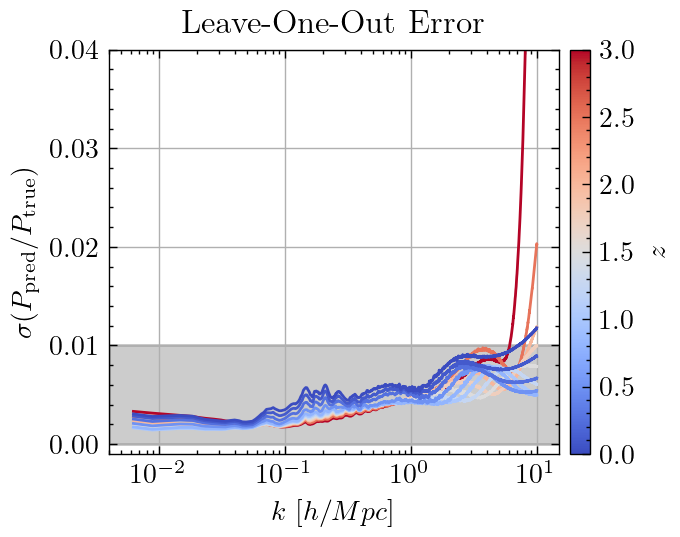

## China Space Station Telescope (CSST) Emulator

A python package for CSST cosmological emulator.
This package is only dependent on `numpy`, `scipy` packages.
All the gaussian process trainings have been done in advance.
The whole package predicts the cosmological statistics [e.g., nonlinear matter power spectrum] with ~ **1 millisecond per cosmology**.

The parameter space are shown as followed:
| Parameter | Lower Limit | Upper Limit |
| --------- | ----------- | ----------- |
| $\Omega_b$          | 0.04  | 0.06    |
| $\Omega_m$          | 0.24  | 0.40    |
| $H_0$               | 60    | 80      |
| $n_s$               | 0.92  | 1.00    |
| $A_s\times 10^{9}$  | 1.7   | 2.5     |
| $w$                 | -1.3  | -0.7    |
| $w_a$               | -0.5  | 0.5     |
| $\sum M_{\nu}$      | 0     | 0.3     |

Up to now, the supportted statistics include:
1. `PkLin`: Linear matter power spectrum ($0\leq z \leq3$ and $10^{-5}\leq k \leq 100 {\rm\  hMpc^{-1}}$);
2. `Pkmm`: Matter power spectrum ($0\leq z \leq3$ and $0.00628\leq k \leq 10 {\rm\  hMpc^{-1}}$);
3. `Xihm`: Halo-matter cross-correlation function ($0\leq z \leq0.8$ and $10^{-2}\leq r \leq 500 {\rm\ h^{-1}Mpc}$). Now this only supports **7** fixed mass bin: `[13.0, 13.2, 13.4, 13.6, 13.8, 14.0, 14.4, 15.0]`;
4. `Ximm`: Matter-matter correlation function ($0\leq z \leq3$ and $r \geq 10^{-2} {\  h^{-1}\mathrm{Mpc}}$);
5. `Cell`: Lensing convergence power spectrum ($0.5\leq z_s \leq3.0$);
6. comming soon ~~ :).

The accuracy for the matter power spectrum on the whole parameter space is shown as followed:

## Dependence

- `numpy`
- `scipy`
- `CAMB`  [optional]
- `CLASS` [optional]
- `CCL`   [optional]

## Usage

You can see the documentation on [readthedocs](https://csst-emulator.readthedocs.io/en/latest) for more details.
Some `examples` are shown in the `test` directory.

## Acknowledgements
Feel free to contact <chyiru@sjtu.edu.cn> if you have any questions.  
