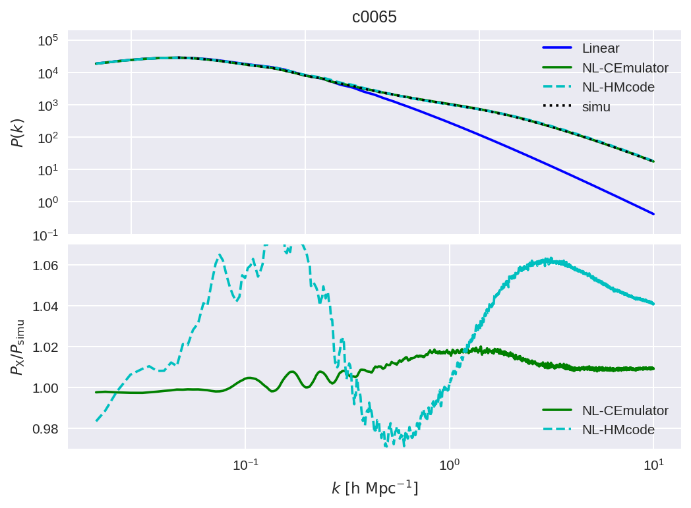

## China Space Station Telescope (CSST) Emulator

A python package for CSST cosmological emulator.
This is only dependent on `numpy` and `scipy` packages.
All the gaussian process trainings have been done in advance.
Therefore, the whole package predicts the cosmological statistics accroding to the matrix calculation.
Up to now, the supportted statistics include:
1. `PkLin`: Linear matter power spectrum ($0\leq z \leq3$ and $10^{-5}\leq k \leq 100 {\rm\  hMpc^{-1}}$) 
2. `Pkmm`: Matter power spectrum ($0\leq z \leq3$ and $0.00628\leq k \leq 10 {\rm\  hMpc^{-1}}$)
3. `Xihm`: halo-matter cross-correlation function ($0\leq z \leq0.8$ and $10^{-2}\leq r \leq 500 {\rm\ h^{-1}Mpc}$). Now this only supports **7** fixed mass bin: `[13.0, 13.2, 13.4, 13.6, 13.8, 14.0, 14.4, 15.0]`
4. comming soon ~~ :)

An example for the matter power spectrum is shown as followed:

## Acknowledgements
Feel free to contact <chyiru@sjtu.edu.cn> if you have any questions.  
