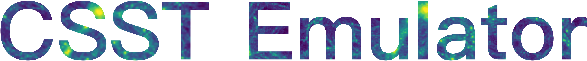

Welcome to CSST Emulator's documentation!
=========================================

**CSST Emulator** is a cosmological emulator for China Space Station Telescope (**CSST**) optical survey.
This is a pure Python package that provides a simple and intuitive API for predicting the commonly used statistics, 
e.g., matter power spectrum.
Its trainning data includes **129** high-resolution N-body simulations, which are generated by 
the modified version of the `Gadget-4` code with **129** different cosmologies.
So it can achieve a high accuracy in a wide range of cosmological parameters as followed.

+-------------------------------+-------------+-------------+
| Parameter                     | Lower Limit | Upper Limit |
+===============================+=============+=============+
| :math:`\Omega_b`              | 0.04        | 0.06        |
+-------------------------------+-------------+-------------+
| :math:`\Omega_m`              | 0.24        | 0.40        |
+-------------------------------+-------------+-------------+
| :math:`H_0`                   | 60          | 80          |
+-------------------------------+-------------+-------------+
| :math:`n_s`                   | 0.92        | 1.00        |
+-------------------------------+-------------+-------------+
| :math:`A_s\times 10^{9}`      | 1.7         | 2.5         |
+-------------------------------+-------------+-------------+
| :math:`w`                     | -1.3        | -0.7        |
+-------------------------------+-------------+-------------+
| :math:`w_a`                   | -0.5        | 0.5         |
+-------------------------------+-------------+-------------+
| :math:`\sum M_{\nu}`          | 0           | 0.3         |
+-------------------------------+-------------+-------------+

The detailed cosmologies can be found in the :doc:`cosmologies` section.
Check out the :doc:`usage` section for further information, including
how to :ref:`installation` the project.

.. note::

   This project is under **active** development. 
   You can visit the `GitHub repository <https://github.com/czymh/csstemu/dev>`__ for the latest updates.

Contents
--------

.. toctree::
   :maxdepth: 2
   :caption: Emulator
   :hidden:
   
   usage
   api
   
.. toctree::
   :maxdepth: 2
   :caption: Data
   :hidden:

   cosmologies
   visualization

Acknowledgement
---------------

Feel free to contact <chyiru@sjtu.edu.cn> or leave an issue on the GitHub if you have any questions.
