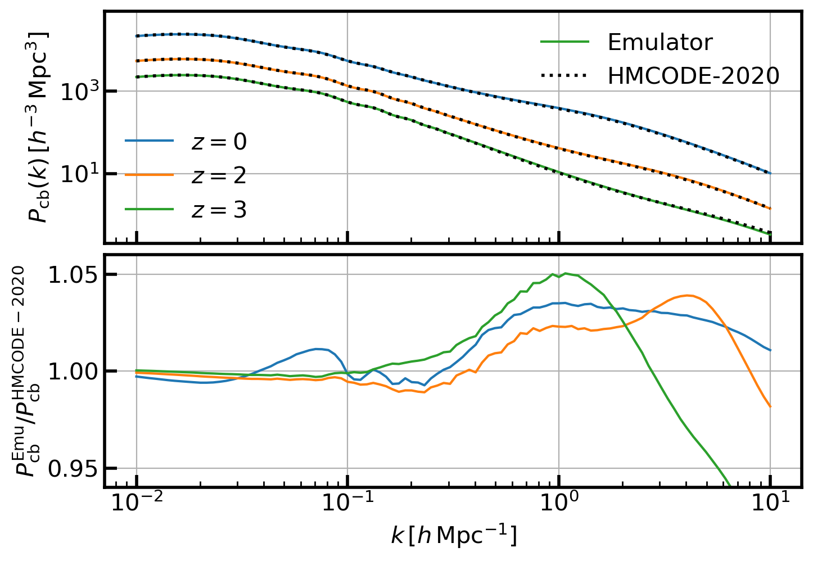
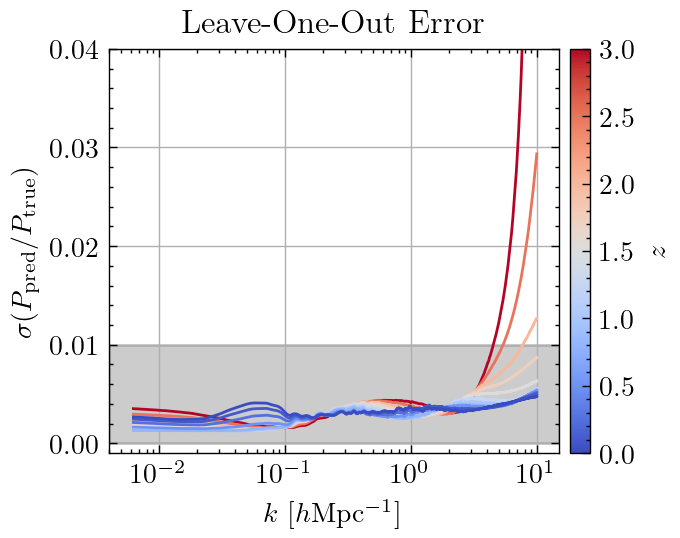

Matter Power Spectrum
=====================

Quick Usage
-----------

To use the package, you need add the code directory to your Python path:

.. code-block:: python

   from CEmulator.Emulator import Pkmm_CEmulator

Firstly, you need to create an object of the class :py:class:`CEmulator`:

.. code-block:: python

   csstemu = Pkmm_CEmulator()

.. note:: 
   By default, the emulator outputs results under the cosmology with single massive neutrino component if :py:class:`mnu != 0`. 
   If you want to use the cosmology with three degenerate massive neutrino components, you need to set the :py:class:`neutrino_mass_split = 'degenerate'` through:
   
   .. code-block:: python

      csstemu = Pkmm_CEmulator(neutrino_mass_split='degenerate')
   

   Then the emulator will output results under the cosmology with three degenerate massive neutrino components.
   You can also obtain the matter power spectrum transfer function from :py:class:`single` to :py:class:`degenerate` by using :py:class:`Tkmm_CEmulator`.

Then set the cosmologies you want to use:

.. code-block:: python

   csstemu.set_cosmos(Omegab=Omegab, Omegac=Omegac, H0=h0*100,
                      ns=n_s, As=A_s, w=w0, 
                      wa=wa, mnu=m_nu)

All these variables can be float numbers or arrays.
Finally, you can predict the :py:class:`cb` matter power spectrum:

.. code-block:: python
   
   zlist = np.array([0.0, 1.5, 3.0])
   klist = np.logspace(-2, 1, 100)
   pkcb = csstemu.get_pknl(z=zlist, k=klist, Pcb=True, lintype='Emulator', nltype='hmcode2020')

Or you can obtain the :py:class:`tot` matter power spectrum through set :py:class:`Pcb=False`:

.. code-block:: python
   
   pkmm = csstemu.get_pknl(z=zlist, k=klist, Pcb=False, lintype='Emulator', nltype='hmcode2020')

This output only needs :py:class:`numpy` and :py:class:`scipy` to run.
If you have installed the :py:class:`CLASS` or :py:class:`CAMB` package, you can also use directly get the results from the traditional Boltzmann code:

.. code-block:: python

   camb_results = csstemu.get_camb_results(z=zlist, kmax=10.0, non_linear='mead2020')
   pkfunc = camb_results.get_matter_power_interpolator(nonlinear=True,
                                                      hubble_units=True, k_hunit=True,
                                                      var1='delta_nonu', var2='delta_nonu')
   pkcbhm20 = pkfunc.P(zlist, klist)   
   pkfunc = camb_results.get_matter_power_interpolator(nonlinear=True,
                                                      hubble_units=True, k_hunit=True,
                                                      var1='delta_tot', var2='delta_tot')
   pkmmhm20 = pkfunc.P(zlist, klist)
   
Then compare the results:

.. code-block:: python

   gridp = plt.GridSpec(2, 1, hspace=0.05)
   with plt.style.context('article'):
      ax0 = plt.subplot(gridp[0,0])
      for iz in range(len(zlist)):
         l1, = plt.plot(klist, pkcb[iz], label=r'$z=%.0f$'%(zlist[iz]))
         l2, = plt.plot(klist, pkcbhm20[iz], 'k:', lw=2.0)
      leg1 = plt.legend([l1, l2], ['Emulator', 'HMCODE-2020'], loc=0, frameon=False)
      leg2 = plt.legend(loc=3, frameon=False)
      ax0.add_artist(leg1)
      plt.grid(True)
      plt.ylabel(r'$P_{\rm cb}(k)\, [h^{-3}\,{\rm Mpc}^3]$')
      plt.xscale('log')
      plt.yscale('log')
      plt.ylim(2e-1, 9e4)
      ax0.set_xticklabels([])
      ax1 = plt.subplot(gridp[1,0])
      for iz in range(len(zlist)):
         l1, = plt.plot(klist, pkcb[iz]/pkcbhm20[iz], label=r'$z=%.0f$'%(zlist[iz]))
      plt.ylabel(r'$P_{\rm cb}^{\rm Emu}/P_{\rm cb}^{\rm HMCODE-2020}$')
      plt.xlabel(r'$k\, [h\,{\rm Mpc}^{-1}]$')
      plt.xscale('log')
      plt.ylim(0.9401, 1.0599)
      plt.grid(True)

For further usage, please refer to the `API documentation <api.html>`_.
You can also get more examples from the `example notebooks <https://github.com/czymh/csstemu/blob/master/test/test-pkmm.ipynb>`_.

Notebook Example
----------------

Here, we show some examples to use the :py:class:`Pkmm_CEmulator` class in the `Jupyter notebook <https://github.com/czymh/csstemu/blob/master/test/test-pkmm.ipynb>`_.

.. toctree::
   :maxdepth: 1

   ./notebook/test-pkmm.ipynb

Accuracy
--------

The Leave-One-Out accuracy of the emulator arcross the whole :ref:`cosmology-table` is shown as followed:

