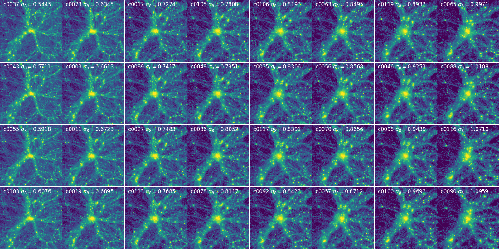

Visualization
==============

The following is the visualizations produced from CSST simulations.

Firstly, we show the density field in 200 Mpc/h box for different cosmologies.

   200 Mpc/h density plot. Download here: :download:`2.8M dpi=100 PNG <./pic/field200Mpc_over_h_lowres.png>`. A high resolution version is available :download:`23M dpi=300 PNG <./pic/field200Mpc_over_h.png>`.

Then we show the halo distribution in 200 Mpc/h box for different cosmologies.

Then we illustrate the plots at smaller scales.
Much larger changes between different subplots than previous plot, which indicates much information hiden in small scales.

   50 Mpc/h density plot. Download here: :download:`2.8M dpi=100 PNG <./pic/field50Mpc_over_h_lowres.png>`. A high resolution version is available :download:`25M dpi=300 PNG <./pic/field50Mpc_over_h.png>`.

   24 Mpc/h density plot. Download here: :download:`2.7M dpi=100 PNG <./pic/halo_lowres_arrayplots.png>`. A high resolution version is available :download:`24M dpi=300 PNG <./pic/halo_arrayplots.png>`.

Other visualizations are coming soon.

